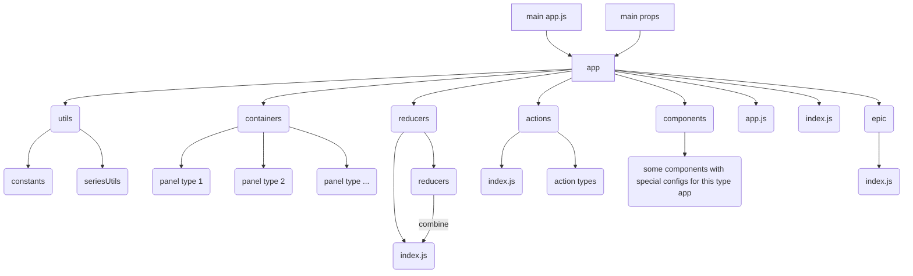
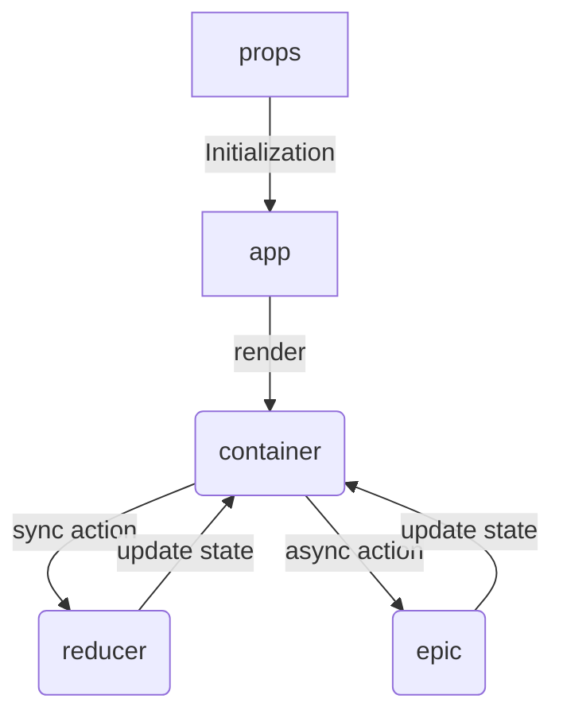

### Chart3React app structure



> 
>```js
>app/utils/constants
>```
> some constants only used in this type app

>
>```js
>app/utils/seriesUtils
>```
>some functions for series parse, format and so on only used in this type app

#### app works flow



